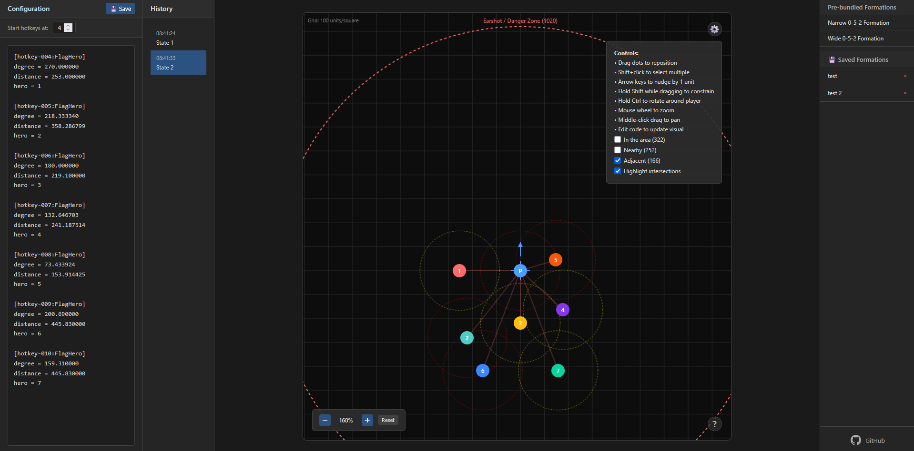

# GWToolbox Flagging Formation Editor

A web-based visual editor for creating and managing hero flagging formations for [GWToolbox++](https://www.gwtoolbox.com/) in Guild Wars.

- **Drag and arrange** hero positions visually.
- **Edit formation code** directly.
- **Save and load** custom formations.
- **History panel** for undo/redo.
- **Pre-bundled formations** for quick setup.

## Usage

1. Open https://le-vagabond-gh.github.io/GWToolbox-Flagging-Formation-Editor/ or the `gwtoolbox-flagging-editor.html` file in your browser.
2. Arrange heroes and copy the generated code.
3. Paste the code into your `GWToolbox.ini` file.
